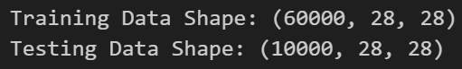
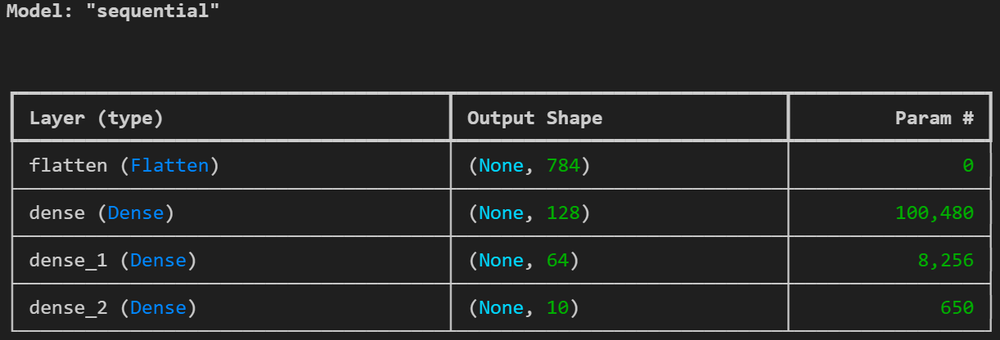
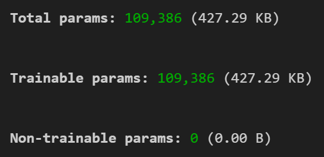
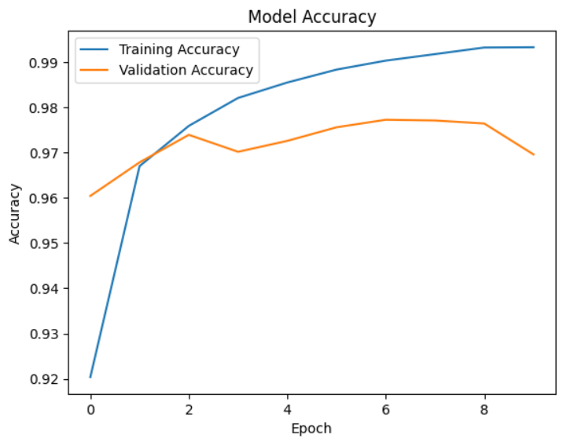
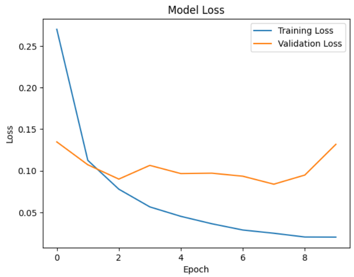
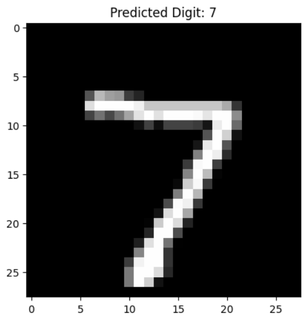

# 🧠 Handwritten Digit Recognition using Deep Learning

<p align="center">


</p>

---

# 📌 Project Overview

This project demonstrates how a **Deep Learning Neural Network** can recognize **handwritten digits (0-9)** from images.

The model is trained using the **MNIST Handwritten Digits Dataset**, which contains thousands of handwritten number images.

By learning patterns from these images, the neural network can accurately **predict digits with ~97–98% accuracy**.

This project is designed as a **beginner-friendly implementation of deep learning using TensorFlow and Keras**.

---

# 🧠 What is Deep Learning?

**Deep Learning** is a branch of **Machine Learning** that uses **Artificial Neural Networks with multiple layers** to learn patterns from large datasets.

It is inspired by the **structure and function of the human brain**.

### 🌍 Real-World Applications

- 📷 Image Recognition  
- 🗣 Speech Recognition  
- 🚗 Self-Driving Cars  
- 🏥 Medical Image Diagnosis  
- 🛒 Recommendation Systems  

---

# 📊 Dataset Information

The project uses the **MNIST Handwritten Digits Dataset**.

| Feature | Value |
|------|------|
| Training Images | 60,000 |
| Testing Images | 10,000 |
| Image Size | 28 × 28 pixels |
| Classes | Digits 0 – 9 |
| Image Type | Grayscale |

Each image represents a **handwritten number**.

---

# 📂 Dataset Shape

The dataset structure after loading is shown below.

<p align="center">

</p>

---

# ⚙️ Data Preprocessing

Before training the neural network, the dataset is prepared using the following steps:

✔ Normalize pixel values **(0–255 → 0–1)**  
✔ Convert labels into **categorical format**  
✔ Split dataset into **training and testing data**

These steps help the neural network **learn faster and improve accuracy**.

---

# 🧩 Model Architecture

The neural network used in this project contains multiple layers.

```
Input Image (28 × 28)

↓ Flatten Layer

784 Input Features

↓ Dense Layer
128 Neurons (ReLU)

↓ Dense Layer
64 Neurons (ReLU)

↓ Output Layer
10 Neurons (Softmax)
```

### Model Structure

<p align="center">

</p>

---

# 🔢 Model Parameters

The neural network parameters used during training are shown below.

<p align="center">

</p>

---

# 🚀 Model Training

The model is trained using the following configuration:

| Parameter | Value |
|------|------|
| Optimizer | Adam |
| Loss Function | Categorical Crossentropy |
| Epochs | 10 |
| Batch Size | 32 |

During training, the neural network gradually **improves its prediction accuracy**.

---

# 📈 Training Accuracy Graph

This graph shows how the **model accuracy improves during training**.

<p align="center">

</p>

---

# 📉 Training Loss Graph

This graph shows how the **model error decreases during training**.

<p align="center">

</p>

---

# 🔍 Prediction Example

The trained model predicts handwritten digits from test images.

<p align="center">

</p>

Example Output:

```
Predicted Digit: 7
```

---

# 🧪 Model Performance

After training, the model is evaluated on the testing dataset.

```
Test Accuracy: ~97–98%
```

This means the neural network correctly predicts **most handwritten digits**.

---

# 🛠 Technologies Used

| Technology | Purpose |
|------|------|
| Python | Programming Language |
| TensorFlow | Deep Learning Framework |
| Keras | Neural Network API |
| NumPy | Numerical Computation |
| Matplotlib | Graph Visualization |
| Jupyter Notebook | Model Development |

---

# 📁 Project Structure

```
project5
│
├── project-deeplearning.ipynb
├── README.md
│
└── images
    ├── accuracy_graph.png
    ├── data_shape.png
    ├── loss_graph.png
    ├── model_sequential.png
    ├── params.png
    └── prediction.png
```

---

# 🎯 Results

✔ Built a **Deep Learning Digit Recognition Model**  
✔ Achieved **~97–98% prediction accuracy**  
✔ Visualized **training accuracy and loss graphs**  
✔ Successfully predicted handwritten digits  

---

# 📚 Conclusion

This project demonstrates how **Deep Learning can solve image classification problems**.

By training a neural network on thousands of handwritten digit images, the model learns visual patterns and accurately predicts new digits.

It serves as a **strong beginner project in Deep Learning and Neural Networks**.

---

# ⭐ Future Improvements

- Improve model using **Convolutional Neural Networks (CNN)**
- Build a **web application for digit recognition**
- Deploy using **Flask or Streamlit**
- Train on **larger datasets**

---

# 👨‍💻 Author

**Deep Learning Academic Project**

Built using **Python • TensorFlow • Keras**

---

⭐ If you like this project, consider **starring the repository on GitHub**.